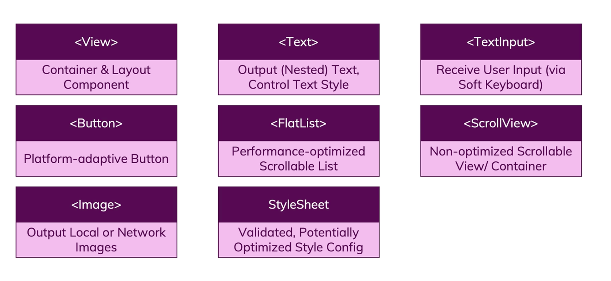

# React Native Reference Git 
Practice Apps for improving React Native skills

## Resources

### React-Native Basics

- Colors Reference: https://reactnative.dev/docs/colors

- Flexbox cheatsheet: https://reactnative.dev/docs/flexbox

- React Hooks: https://reactjs.org/docs/hooks-intro.html

- Official Docs: https://facebook.github.io/react-native/docs/getting-started

- Overview of available Components & APIs: https://facebook.github.io/react-native/docs/components-and-apis

- Expo Docs: https://docs.expo.io/versions/latest/

### React Native Debugging

- Expo Debugging Docs: https://docs.expo.io/versions/v34.0.0/workflow/debugging/

- Chrome Dev Tools Docs: https://developers.google.com/web/tools/chrome-devtools/

### React Native Adaptive UI

- Dimensions API - Official Docs: https://facebook.github.io/react-native/docs/dimensions#docsNav

- Platform-specific Code - Official Docs: https://facebook.github.io/react-native/docs/platform-specific-code

### React Navigation

- Docs: https://reactnavigation.org/docs/4.x/getting-started

---
### React Native Guess Game App

#### Concepts

- Working with different components
- Working on layouts
- Styling Card component
- Color theming with constants
- ``TouchableWithoutFeedback``, ``Alert`` components usage
- Switching between Multiple screens
- Adding custom fonts
- Font styling approach - components/default sheets
- Adding local images
    - Using require with ``Image`` component
    - Styling images
    - Using network images
- Nested ``Text`` components
    - Styles passed down to nested ``Text`` components (!!exception!!)
- Building Custom Button component
    - ``TouchableOpacity`` component
    - Adding custom icons - @expo/vector-icons
        - List of expo vector icons: https://expo.github.io/vector-icons/
- UI Library
    - NativeBase: https://docs.nativebase.io/
- ``ScrollView`` for list
    - ``contentContainerStyle`` property
    - ``flexGrow`` property
- ``FlatList`` for list
    - ``contentContainerStyle`` property
    - ``renderItem`` property

---
#### Responsive + Adaptive UI

- ``Dimensions`` API
    - Get Width: ``Dimensions.get('window').width``
    - API with `if` conditions
    - Listening to orientation changes: ``Dimensions.addEventListener('change',function)``
- ``KeyboardAvoidingView`` component
    - ``behavior="position"``
    - ``keyboardVerticalOffset``
- ``ScreenOriention`` API from ``expo``
    - ``lockAsync`` function
- ``Platform`` API
    - ``OS`` property
    - No listeners
    - ``select`` method - ios, android keys
    - Platform-specific files (.android, .ios)
- ``SafeAreaView`` component

---
### React Native Meals App

#### Concepts

- React Navigation npm package

##### Stack Navigator
- Creating Stack Navigator 
    - ``createStackNavigator`` from ``react-navigation-stack``
    - ``createAppContainer`` from ``react-navigation``
- Navigation between Stacks
    - ``props.navigation.navigate({ routeName: "CategoryMeals" });``
    - ``push`` method to push different as well as same screen
    - Going Back
        - ``props.navigation.goBack();`` 
        - ``props.navigation.pop();`` 
        - ``props.navigation.popToTop();``
    - Replacing stack screen: ``props.navigation.replace("CategoryMeals" );``
- ``FlatList`` with ``numColumns`` property - for gridView
- ``TouchableOpacity`` for click events
- ``navigationOptions`` property
    - ``headerTitle``, ``headerStyle``, ``headerTintColor``
    - Can be a function for dynamic properties
    - ``defaultNavigationOptions`` in ``createStackNavigator``
- ``navigate`` method ``params`` for passing data across stacks
    - Fetch param: ``props.navigation.getParam('categoryId')``
- ``react-native-screens`` npm package
    - ``enableScreens`` method
- ``ImageBackground`` component
- ``react-navigation-header-buttons`` npm package for adding buttons on header
    - ``HeaderButtons``, ``Item`` component
    - ``HeaderButtonComponent`` property
##### Tab Navigator
- Creating Tab Navigator
    - ``import { createBottomTabNavigator } from "react-navigation-tabs";``
    - ``tabBarOptions`` property
        - ``activeTintColor``
    - Setting Icons: ``navigationOptions`` -> ``tabBarIcon``
    - Setting Label: ``navigationOptions`` -> ``tabBarLabel``

